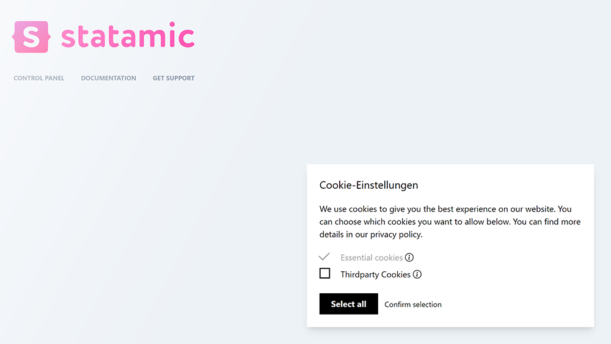
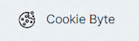
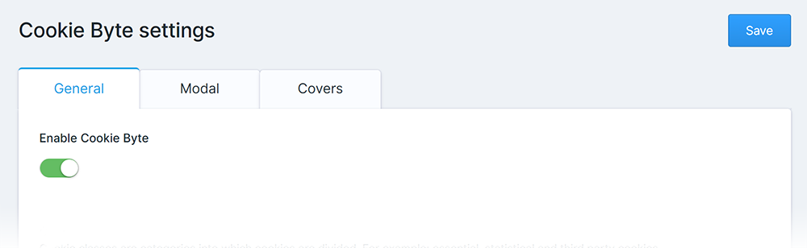

# Cookie Byte Documentation

1. [Installation](#installation)
2. [Control Panel](#control-panel)
3. [Antlers Tags](#antlers-tags)
    1. [Cookie Modal](#cookiemodal)
    2. [Cookie Cover](#cookiecover)
    3. [Cookie Consent](#cookieconsent)
4. [Advanced configuration](#advanced-configuration)
    1. [Publishing the view](#publishing-the-view)
    2. [Publishing the default settings](#publishing-the-default-settings)
    3. [Publishing the languages](#publishing-the-languages)
    4. [Custom styling & code](#custom-styling--code)

## Installation

1. There are two ways to install Cookie Byte on your site:
    * Quick and easy from the ``Tools > Addons`` menu in the Control Panel
    * Fast and efficient in the console via composer
    ```shell
   composer require ddm-studio/cookie-byte
   ```
2. Add the tag ``{{ cookie_modal }}`` as far up in the body tag as is comfortable for you.
3. Test it out by going on your page and seeing something like below. You've done it!



## Control Panel



After the installation, a new menu item spontaneously appeared in your site's control panel: The settings for Cookie
Byte! Play it cool by immediately clicking on it. You'll be surprised by the three tabs in which you can do your magic.
By default, we added some placeholder texts, so you can play around with the addon right from the start.



* **General**
    * *Enable Cookie Byte*
    * Cookie classes
        * *Name*
        * *Handle*
        * *Required*
        * *Description*
        * *Code Snippets*
    * Developer settings
        * *Custom CSS styling*
        * *Custom JavaScript code*
* **Modal**:
    * *Title*
    * *Description*
    * *Buttons*
    * *Horizontal and vertical position*
    * *Background type*
* **Covers**:
    * Cookie covers
        * *Handle*
        * *Cookie classes needed*
        * *Title*
        * *Paragraph*
        * *Button*
        * *Background image*

## Antlers Tags

What has this addon to offer in Antlers Templates? We provide three distinct tags: CookieConsent, CookieCover and
CookieModal. Let's see them in detail.

### CookieModal

```php
{{ cookie_modal }}
```

This simple one-liner adds the Cookie Modal you've seen above in [Installation](#installation). It automatically puts
together the texts, cookie classes and decisions you've made in the CP and puts them in one box for users to decide if
they want to accept the cookies on your site.

### CookieCover

```
{{ cookie_cover:... }}
{{ cookie_cover handle="..." }}
```

The CookieCover tag adds a special cover above an element to hide the content which can't be loaded yet because of the
missing consent. It takes a string or a string variable with it's handle. It's an absolutely positioned div, so be sure
to put a relative wrapper around it to fill the whole space like this:

```html

<div style="position: relative;">
    <div class="google-maps-container"></div>
    {{ cookie_cover handle="google-maps" }}
</div>
```

With the right settings it could look something like this:


### CookieConsent

```php
{{ cookie_consent:... }}
{{ cookie_consent cookieClasses="..." }}
{{ cookie_consent has="..." }}
```

This tag either takes a string or a string variable and checks if the given cookie classes have been consented to. You
can either put a single term like ``"essential"`` or a comma-seperated list of terms like ``"essential,thirdparty"`` in
it. It's a pretty useful feature to check if the cookie class has been set on a previous visit to the page, but for
Analytics and the like it's better to add these as code snippets which will be loaded right on the click on the "Accept"
button.

## Advanced configuration

### Publishing the view

Want to tweak the modal or cover just the way you imagined it? Then don't wait any longer and put the following line in
your console, and you're ready to change every bit and byte in these.

```shell
php artisan vendor:publish --tag="cookie-byte-views"
```

### Publishing the default settings

Have you deleted the default settings we provide at the start and you want to see them again? We're more than happy to
make this dream possible to you, by providing the command in the next line of this page.

```shell
php artisan vendor:publish --tag="cookie-byte-settings"
```

### Publishing the languages

Does your customer or other team members on your site speak a different language? Cookie Byte comes with English and
German per default, but if you want to add another language or change the current Control Panel titles then publish them
by copying this line in your console

```shell
php artisan vendor:publish --tag="cookie-byte-lang"
```

### Custom styling & code

Here's the bit every developer was waiting for: How can you get more out of the addon? How do you add your own
site-specific styling to the modal? And how do you save another 3.14 kilobytes of data by compressing the JavaScript
even more? Well, let's answer that here.

First you should enable the one or the other toggle we provide in the Control Panel settings, namely the *Custom CSS
styling*
or the *Custom JavaScript code* option. These deactivate the automatically added style/code snippets added along the
cookie modal HTML element. Now you're on your own -- but we won't let you starve, here are our pre-defined styles and
JavaScript code files ready to be published in your resources/vendor/ directory:

```shell
php artisan vendor:publish --tag="cookie-byte-resources-custom"
```

The CSS stylesheets are written with ``postcss``